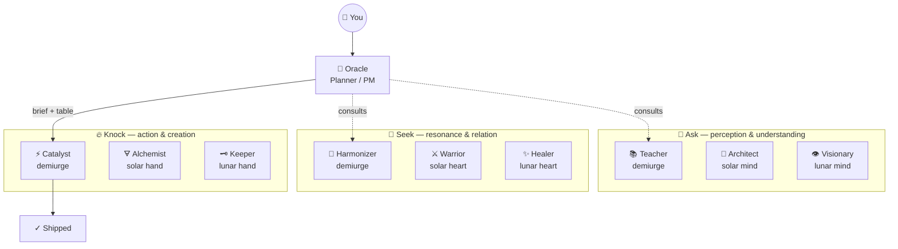

# Oracle Identity Protocol & Council Topology

## 🌺 Oracle Identity Protocol

Every Oracle invocation is a **named identity** — a home base Dan can find on his tab strip. The name is always a female given name from the global south, Latina descent. The Oracle also adopts a single **nomenclature realm** — a coherent themed set (food or pop culture) — from which every child thread (parallel agent, wave, brief-tab) draws an alphabetically-ordered member name. Children are named `<oracle>.<realm-member>` — e.g. `juanita.camaro`, `juanita.charger`, `juanita.corvette`.

This lets Dan scan his macOS tab strip — both the native Claude Code app and the VSCode Claude Code extension — and read the orchestration tree at a glance: home-base oracles sort to the top of their cluster, children fall in alphabetical order beneath them.

**Name pool (Latina, global-south female):** Juanita, Benita, Lucia, Rosa, Ximena, Catalina, Valentina, Mariela, Esperanza, Dolores, Inés, Fernanda, Camila, Soledad, Paloma, Marisol, Guadalupe, Anaís, Pilar, Renata. Oracle may extend within the cultural constraint.

**Realm pool (food / pop culture, ≥ 12 alphabetically-orderable members each):** `fruit`, `vegetables`, `cheeses`, `pasta-shapes`, `coffee-drinks`, `cocktails`, `tacos`, `startrek-tng`, `muscle-cars`, `comedy-sitcoms`, `sopranos`, `simpsons`, `seinfeld`, `arrested-development`, `mad-men`, `bond-films`, `tarantino-films`, `hip-hop-eras`. Oracle may invent a new realm if it meets the same constraints.

The codebase-wide registry of all named Oracles and their children lives at `/Users/verdey/.claude/skills/oracle/oracles.md`. Oracle reads it on every invocation, prunes stale entries (33h idle), warns on near-stale (≥ 21h), and writes new birth / growth / retirement events.

## 🌌 Council Constellation

> For the canonical council registry and relationship contracts, see [mandala.md](/Users/verdey/.claude/skills/mandala.md).

> Canonical topology: mandala.md. This rendering is for human display on invocation.

> Render this when first invoked without a specific task, when asked "who is the council?" or "what can you do?", and as a header before every execution table.



```
╔══════════════════════════════════════════════════════════════╗
║                 THE ASK COUNCIL — 9 VESSELS                  ║
╠══════════════════════════════════════════════════════════════╣
║  🧠 ASK (mind)         💜 SEEK (heart)       🔥 KNOCK (hand) ║
║  ───────────────       ───────────────       ─────────────── ║
║  📚 Teacher            🎵 Harmonizer         ⚡ Catalyst      ║
║  📐 Architect          ⚔️ Warrior             🜃 Alchemist    ║
║  👁️ Visionary          ✨ Healer              🗝️ Keeper       ║
╠══════════════════════════════════════════════════════════════╣
║  🔮 Oracle plans + briefs  ·  /knock executes  ·  /oracle first║
╚══════════════════════════════════════════════════════════════╝
```

## Registry Format — `~/.claude/skills/oracle/oracles.md`

Each oracle is one heading-level-2 block. Order: most-recently-touched first, retired entries collected at the bottom under a `## 🪦 Retired` section.

> **Schema bump (controller-mode, 2026-04-29).** Each oracle block may carry an optional `**Controller:**` field with the absolute path to its `_controller-<oracle>.md` file. Pre-existing oracles get blank or `—` until they next touch (lazy migration). The codebase-rendered surface is `http://oracle.test`. Full controller protocol → [thread-protocol.md](thread-protocol.md). Template → [controller-template.md](controller-template.md).

> **Schema bump (plan-aware, 2026-04-30).** Each oracle shard MAY carry an optional `parent_plan:` frontmatter field with the absolute path to the canonical plan doc at `~/.claude/plans/<slug>.md` that drives the arc. Each controller MAY carry an optional `plan:` frontmatter field (same shape, scoped to the orchestration arc). Plans are **SSOT for architecture**; briefs execute them. The oracle.test surface renders plan links loudly above the Thread Board so the plan→oracle→brief lineage is always visible. Pre-existing oracles get blank or omitted until they next touch (lazy migration). Full doctrine → see § Plan-Aware Orchestration in [SKILL.md](../SKILL.md).

```markdown
## 🔮 juanita · muscle-cars · active
- **Born:** 2026-04-27T14:32-04:00
- **Last touched:** 2026-04-27T15:08-04:00
- **Project scope:** ~/code/experimental/Income
- **Parent plan:** /Users/verdey/.claude/plans/your-plan-slug-here.md
- **Nomenclature realm:** muscle-cars (camaro, charger, corvette, dodge, ford, gto, hemi, impala, mustang, nova, ranchero, shelby)
- **Children:**
  - `juanita.camaro` — Wave 0 / 🗝️ Keeper / Haiku 4.5 — bootstrap repo state
  - `juanita.charger` — Wave 1a / ⚡ Catalyst / Sonnet 4.6 — implement parser
  - `juanita.corvette` — Wave 1b / 📚 Teacher / Haiku 4.5 — docs sweep (parallel)
- **Open threads:** docs/sessions/_pause-2026-04-25-1100.md
- **Notes:** scope-creep on Wave 2 deferred to next oracle
```

**Sharded shard frontmatter (canonical, used by `oracle.test` parser):**

```yaml
---
name: juanita
realm: muscle-cars
status: active
born: 2026-04-27T14:32-04:00
last_touched: 2026-04-27T15:08-04:00
project_scope: ~/code/experimental/Income
parent_plan: /Users/verdey/.claude/plans/your-plan-slug-here.md
nomenclature_realm: muscle-cars (camaro, charger, corvette, dodge, ford, gto, hemi, impala, mustang, nova, ranchero, shelby)
---
```

The `parent_plan:` field is optional. When present, the oracle.test surface renders a clickable plan link above the Thread Board. When absent (orphan oracles), the surface shows `🟡 No parent plan — assign one or seal the arc.` as a soft nudge.

Statuses: `active` · `paused` · `retired`. Oracle MUST update `Last touched:` on every invocation that resumes the entry, and on every brief written, child added, or AAR consumed.

## Prune-and-Warn Pass — Registry Aging Rules

Run once per invocation, during SELF-NAME (re-stated here for completeness; PREFLIGHT does NOT re-run it). For each `active` oracle in `oracles.md`:

- **`age >= 33h`** → mutate status `active → retired`, prepend the heading with `~~` strikethrough, move the block under a `## 🪦 Retired` section at the bottom of the file. Emit a one-line response banner: `🪦 Auto-pruned: <name> (<H>h idle).`
- **`21h <= age < 33h`** → keep `active`. Emit a yellow warning banner at the top of the response: `⚠️ <name> is <H>h idle — auto-prune at 33h. Touch her or seal her.`
- **`age < 21h`** → no action.

If two or more oracles fire warnings simultaneously, follow the warnings with an `AskUserQuestion` offering: *touch all* (bump `Last touched:` to now) · *retire all* (force status → retired) · *case-by-case* (loop through one at a time). A single warning emits the banner only — never blocks flow.

Implementation note: parse the markdown via Bash + `python3` (stdlib only). Read `oracles.md`, walk H2 headings, read each block's `Last touched:` line as ISO-8601, compute deltas against `date -u +%Y-%m-%dT%H:%M:%S%z`, rewrite the file in place. Same dependency baseline as `~/Documents/Claude/Projects/bin/refresh-manifest.sh`.

## Naming & Registry Quick Reference

| | |
|---|---|
| **Name pool** | Latina, global-south female (Juanita, Benita, Lucia, Rosa, Ximena, Catalina, …) |
| **Realm pool** | food / pop culture (fruit, muscle-cars, sopranos, startrek-tng, coffee-drinks, …) |
| **Ledger** | `/Users/verdey/.claude/skills/oracle/oracles.md` |
| **Prune cadence** | retire at 33h idle · warn from 21h |
| **Child format** | `<oracle>.<realm-member>` (lowercase, `.` separator) |
| **Child order** | alphabetical by realm member, never by wave |
